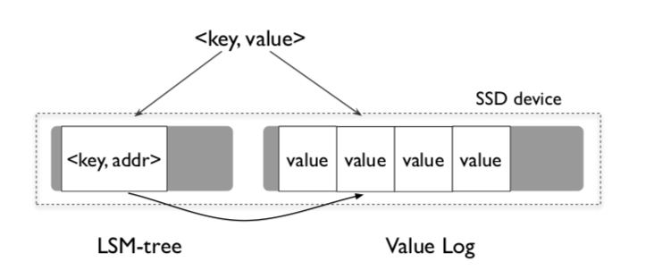

**[WiscKey](https://www.usenix.org/conference/fast16/technical-sessions/presentation/lu) is a highly SSD optimized
key-value storage based on LevelDB, presented in a paper published in 14th USENIX Conference on File and Storage
Technologies in Feb 2016. This is my implementation derived from LevelDB v1.23.**

**[WiscKey](https://www.usenix.org/conference/fast16/technical-sessions/presentation/lu)
是一个对SSD高度优化的基于LevelDB的KV存储，发表在2016年2月第14届USENIX文件和存储技术会议上。这是我从LevelDB v1.23派生出的对WiscKey的实现。**

| [LevelDB Readme file](./LevelDB_README.md)| [LevelDB描述文档](./LevelDB_README.md)|
| :----| ----:|

---

# Feature

* Separate keys from values, only keys are stored in LSM-tree, while values are stored in value-log file (vlog).

* Highly write performance optimized on SSD. When benchmarked with default configuration, Wisckey is double faster than
  leveldb on sequential writing and treble faster on random writing.

#### LevelDB vs Wisckey

* Environment.

```
  LevelDB:    version 1.23
  CPU:        8 * AMD EPYC 7K62 48-Core Processor
  CPUCache:   512 KB
  Keys:       16 bytes each
  Values:     100 bytes each (50 bytes after compression)
  Entries:    1000000
  RawSize:    110.6 MB (estimated)
  FileSize:   62.9 MB (estimated)
```

* LevelDB

```
fillseq      :       1.876 micros/op;   59.0 MB/s
fillsync     :    4339.058 micros/op;    0.0 MB/s (1000 ops)
fillrandom   :       4.270 micros/op;   25.9 MB/s
overwrite    :       6.613 micros/op;   16.7 MB/s
readrandom   :       4.233 micros/op; (864322 of 1000000 found)
readrandom   :       2.791 micros/op; (864083 of 1000000 found)
readseq      :       0.159 micros/op;  696.6 MB/s
readreverse  :       0.371 micros/op;  298.3 MB/s
compact      : 1360175.000 micros/op;
readrandom   :       2.110 micros/op; (864105 of 1000000 found)
readseq      :       0.136 micros/op;  816.2 MB/s
readreverse  :       0.333 micros/op;  332.2 MB/s
fill100K     :    2191.526 micros/op;   43.5 MB/s (1000 ops)
crc32c       :       1.543 micros/op; 2530.9 MB/s (4K per op)
```

* WiscKey

```
fillseq      :       0.999 micros/op;  110.7 MB/s
fillsync     :     515.485 micros/op;    0.2 MB/s (1000 ops)
fillrandom   :       1.323 micros/op;   83.6 MB/s
overwrite    :       1.845 micros/op;   60.0 MB/s
readrandom   :       3.420 micros/op; (864322 of 1000000 found)
readrandom   :       3.077 micros/op; (864083 of 1000000 found)
readseq      :       0.671 micros/op;  164.8 MB/s
readreverse  :       0.853 micros/op;  129.6 MB/s
compact      :  447341.000 micros/op;
readrandom   :       2.406 micros/op; (864105 of 1000000 found)
readseq      :       0.638 micros/op;  173.3 MB/s
readreverse  :       0.809 micros/op;  136.8 MB/s
fill100K     :      92.249 micros/op; 1034.0 MB/s (1000 ops)
crc32c       :       1.527 micros/op; 2557.8 MB/s (4K per op)
```

# 简介

Wisckey的主要思路是键-值分离。在LSM树中，键是按照顺序存储的，但是值却可以被分离且乱序地管理，只要访问键可以获得键到值的映射即可。
Wisckey将数据的值分离地存储在日志中（称为value-log，简称vlog），LSM树中仅保存对应值在vlog文件中的地址，在查询时先获取地址，然后再到文件中读取数据。
下图示意了键-值分离存储的设计。关系型数据库引擎在实现索引时有着相同的设计：为索引建立的B+树仅存储对应行的指针或主键，当索引覆盖无效时，通过索引的查询需要在表中进行二次查找。



LSM树的操作开销主要来源于Compaction，这是当LSM树某一层的SSTable过大时将数据压向下一层的操作。因为通常来说键的大小要小于值，
因此把值从LSM树中分离出来能显著减小LSM树的大小，降低Compaction的开销。这能大大提高写入数据的性能，同时更少的额外写操作（称之为写放大）有利于提升存储设备寿命，
减少性能损耗，这对于SSD尤为重要。

在查询时Wisckey需要访问vlog文件，这次额外的随机读操作会降低查询的性能。但是较之传统的存储设备，SSD有着更好的随机读性能；同时Wisckey具有更小的LSM树和强度更小的Compaction，
在更小的LSM树上进行查询耗时更少，Compaction的影响也被降低。因此Wisckey的随机查询性能并不会弱于LevelDB。然而在顺序查询的场景下，因为LevelDB中值和键在一起有序存放，
通过LevelDB的迭代器进行范围查询可以顺序地读到数据，但是Wisckey需要随机读取vlog文件，这降低了Wisckey的顺序查询速度。